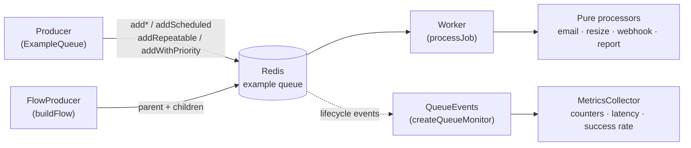

<div align="center">


# bullmq-example

### Production-grade BullMQ patterns in strict TypeScript — priorities, retries, schedules, flows, and metrics.

**Built and maintained by [Viprasol Tech](https://viprasol.com)**

[](LICENSE)
[](tsconfig.json)
[](https://docs.bullmq.io/)
[](https://nodejs.org/)
[](src)
[](src)
[](CHANGELOG.md)

</div>

---

A focused, **best-practice reference** for [BullMQ](https://docs.bullmq.io/) — the
fast Redis-backed job queue for Node.js. Every queue/worker concept you need in
production is here, fully typed, and the *business logic is factored into pure
functions* so the entire test suite runs **without a Redis server**.

## Features

- 📨 **Four typed job kinds** — `email`, `resize`, `webhook`, `report` — modelled as a discriminated union for end-to-end type-safety.
- 🚦 **Named priorities** — `critical` → `bulk`, no magic numbers to memorise.
- 🔁 **Retry & backoff** — fixed or exponential, with validated attempts and delays.
- ⏰ **Scheduled jobs** — run later via a relative delay or an absolute timestamp.
- 📅 **Repeatable / cron jobs** — cron patterns (with timezone) or fixed intervals.
- 🌳 **Parent-child flows** — build typed job trees that wait on their children.
- 📊 **Queue metrics** — a pure, deterministic collector (success rate, latency, in-flight) plus a live `QueueEvents` monitor.
- 🧪 **Redis-free tests** — pure processors and builders mean 57 assertions run in ~1s with no broker.
- 🧱 **Strict TypeScript** — zero `tsc --noEmit` errors, NodeNext ESM, declaration output.

## Architecture



The dashed path (events → metrics) and the pure processors are exactly what the
test suite exercises — no Redis required.

## Install

```bash
git clone https://github.com/Viprasol-Tech/bullmq-example.git
cd bullmq-example
npm install
```

> Running jobs **live** needs a reachable Redis (`docker run -p 6379:6379 redis`).
> The tests do not.

## Quickstart

```bash
npm run typecheck   # tsc --noEmit, zero errors
npm test            # vitest run, 57 passing, no Redis needed
npm run build       # emit dist/
```

## Usage

### Enqueue typed jobs with priority, retry, and scheduling

```ts
import {
  ExampleQueue,
  retryOptions,
} from "bullmq-example";

const queue = new ExampleQueue(); // defaults to 127.0.0.1:6379

// A high-priority email that retries up to 5x with exponential backoff.
await queue.addWithPriority(
  "email",
  { to: "ops@acme.io", subject: "Deploy done", body: "v0.2.0 is live" },
  "high",
  retryOptions({ attempts: 5, strategy: "exponential", delayMs: 500 }),
);

// A webhook delivered 30 seconds from now.
await queue.addScheduled(
  "webhook",
  { url: "https://hooks.acme.io/notify", payload: { event: "deploy" } },
  { delayMs: 30_000 },
);

// A daily report at 09:00 London time.
await queue.addRepeatable(
  "report",
  { reportId: "daily-signups", from: "2025-06-01", to: "2025-06-01" },
  { pattern: "0 9 * * *", tz: "Europe/London" },
);

await queue.close();
```

### Build a parent-child flow

```ts
import { addExampleFlow, countFlowJobs, type FlowNode } from "bullmq-example";

const tree: FlowNode = {
  job: { name: "email", data: { to: "boss@acme.io", subject: "Batch done", body: "ok" } },
  children: [
    { job: { name: "resize", data: { source: "a.png", width: 64, height: 64 } } },
    { job: { name: "report", data: { reportId: "weekly", from: "2025-06-01", to: "2025-06-07" } } },
  ],
};

console.log(`dispatching ${countFlowJobs(tree)} jobs`); // 3
await addExampleFlow(tree); // parent runs only after both children complete
```

### Aggregate live metrics

```ts
import { createQueueMonitor } from "bullmq-example";

const monitor = createQueueMonitor();
// ... let jobs flow ...
console.log(monitor.metrics.snapshot());
// { active, completed, failed, stalled, delayed, successRate, inFlight, avgLatencyMs }
await monitor.close();
```

### Test the work without Redis

```ts
import { processReportJob, MetricsCollector } from "bullmq-example";

processReportJob({ reportId: "r", from: "2025-01-01", to: "2025-01-07" });
// → { status: "generated", reportId: "r", days: 7 }

const m = new MetricsCollector();
m.record({ kind: "active", jobId: "1", at: 0 });
m.record({ kind: "completed", jobId: "1", at: 250 });
m.snapshot().avgLatencyMs; // 250
```

## API

| Export | Kind | Description |
| --- | --- | --- |
| `ExampleQueue` | class | Typed producer: `addEmailJob`, `addResizeJob`, `addWebhookJob`, `addReportJob`, `addWithPriority`, `addScheduled`, `addRepeatable`. |
| `createWorker` / `processJob` | fn | Build a BullMQ `Worker`; `processJob` is the pure dispatcher. |
| `processEmailJob` / `processResizeJob` / `processWebhookJob` / `processReportJob` | fn | Pure, Redis-free unit-of-work functions. |
| `Priority` / `priorityValue` | const/fn | Named priority levels → BullMQ numeric values. |
| `retryOptions` | fn | Build `attempts` + `backoff` options. |
| `scheduledOptions` | fn | Delay a job by `delayMs` or absolute `runAt`. |
| `repeatOptions` | fn | Cron pattern (+`tz`) or fixed `everyMs` interval. |
| `mergeJobOptions` | fn | Compose several option fragments. |
| `buildFlow` / `countFlowJobs` / `addExampleFlow` | fn | Build, count, and dispatch parent-child flow trees. |
| `MetricsCollector` | class | Deterministic event → metrics aggregator. |
| `createQueueMonitor` | fn | Live `QueueEvents` → `MetricsCollector` bridge. |
| `InvalidJobDataError` | class | Thrown on payload validation failure. |

## Roadmap

- [x] Typed jobs, queue, and worker dispatch
- [x] Priorities, retry/backoff, scheduled & repeatable jobs
- [x] Parent-child flows and a Redis-free metrics collector
- [ ] Rate-limited workers and concurrency groups
- [ ] Dead-letter queue helper for exhausted retries
- [ ] OpenTelemetry span emission from the worker
- [ ] Optional Bull Board dashboard wiring

## FAQ

**Do I need Redis to run the tests?**
No. All 57 tests target the pure processors and option/flow/metrics builders.
Redis is only needed to run jobs live (`ExampleQueue`, `createWorker`, flows, monitor).

**Why are priorities "lower = first"?**
That's BullMQ's native semantics. The `Priority` map gives you readable names so
you never have to remember which number wins.

**Can I add my own job type?**
Yes — add it to `JobDataMap`/`JobResultMap` in `src/jobs.ts`, write a pure
processor, and wire one `case` into `processJob`. The compiler guides the rest.

## Contributing

Contributions are welcome! Please read [CONTRIBUTING.md](CONTRIBUTING.md) and our
[Code of Conduct](CODE_OF_CONDUCT.md). In short: fork, branch, keep `npm run
typecheck` and `npm test` green, and open a PR.

## Contact — Viprasol Tech Private Limited

- Website: [viprasol.com](https://viprasol.com)
- Email: [support@viprasol.com](mailto:support@viprasol.com)
- Telegram: [t.me/viprasol_help](https://t.me/viprasol_help) | WhatsApp: +91 96336 52112
- GitHub: [@Viprasol-Tech](https://github.com/Viprasol-Tech) | [LinkedIn](https://www.linkedin.com/in/viprasol/) | X [@viprasol](https://twitter.com/viprasol)

## License

[MIT](LICENSE) (c) 2025 Viprasol Tech Private Limited
